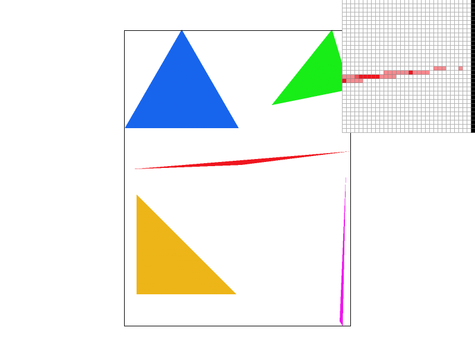

# Project 1

In this project, I filled in code to complete the implementation of a SVG
renderer. Specifically, I implemented logic to (semi-efficiently) identify which
pixels lie inside a triangle based on the location of its vertices. I
implemented supersampling-based anti-aliasing to reduce "jaggies" in the
rendering. For triangles, I also implemented color and texture interpolation
based on barycentric coordinates. The textures were sampled using various forms
of interpolation, using mipmaps to efficiently remove high-frequency artifacts
as appropriate.

## Task 1
Each triangle is defined by three points $(x_i, y_i)$ for $0 \le i < 3$. We
first compute the bounding box of the triangle, bounded by the minimum and
maximum x and y coordinates of these three points. Then, we loop over each test
point $(x, y)$ within this bounding box to check if it lies inside the triangle.

To do so, we make the following observation. Consider a vector representing the
direction of a line passing through the origin. Rotate it 90 degrees
counterclockwise. Then project a test point onto this vector using dot products.
The sign of this projection is positive if the test point is to the "left" of
the original line (facing along the direction vector), zero if it lies on the
line, and negative if it lies to the "right". By translating all coordinates, we
can make a similar determination for the position of a point with respect to a
line not passing through the origin, so long as we know its direction vector and
at least one point on the line.

Now, note that the triangle's vertices are ordered so they are oriented either
"clockwise" or "counter-clockwise". If clockwise, then a point lies inside the
triangle iff it is not to the left of any line between two consecutive vertices.
If counter-clockwise, then a point lies inside the triangle so long as it is not
to the right of any line between consecutive vertices. So we can use the above
sign-of-the-dot-product test to check if a point lies inside the triangle in
either orientation. If so, we color it in, and otherwise we leave it blank.

Mathematically, the test looks like this (in pseudo-code):
```
// let (x, y) be our test point
// let pts[i] = (xi, yi), where pts[0] == pts[3]
cw = true;
ccw = true;
for i in 0..3:
    // the line goes from pts[i] to pts[i+1]
    // treat pts[i+1] as the offset, to translate our line through the origin
    // let (dx, dy) be the direction vector of the line
    dx = pts[i+1][0] - pts[i][0];
    dy = pts[i+1][1] - pts[i][1];

    // we are taking the inner product of (-dy, dx) with ((x, y) - offset)
    auto l = -(x - pts[i+1][0]) * dy + (y - pts[i+1][1]) * dx;

    // if we lie to the left or the right of a line,
    // we rule out the clockwise/counter-clockwise cases, respectively
    if (l > 0) {
        cw = false;
    }
    if (l < 0) {
        ccw = false;
    }
}

// if we are consistent with one orientation, then we are inside the triangle!
inside_triangle = cw || ccw;
```

My algorithm literally just checks every sample within the bounding box, so it
is obviously no worse than such an approach.

A rendering of `basic/test4.svg` follows: 

The inspector is zoomed in on the rightmost coerner of the red triangle. We see
jaggies due to the lack of anti-aliasing, as the triangle thins to a point.

## Task 2
In supersampling, we increase the size of the `sample_buffer` to `width * height
* sample_rate`. We index into it as `sample_buffer[y * width * sample_scale +
x]`, where `sample_scale * sample_scale = sample_rate`, and `x` and `y` are the
supersampled coordinates such that `0 <= x < sample_scale * width`, and `0 <= y
< sample_scale * height`.

The `fill_pixel(x0, y0)` function is modified to fill in all points `(x, y)`
where `x0 * sample_scale <= x < (x0 + 1) * sample_scale` and analogously for
`y`, so we are essentially filling in a small "box" in the buffer. So for points
and lines, which use this function, supersampling has no effect.

However, we do modify the `rasterize_triangle` function to test each sample in
the aforementioned "box" for membership in the triangle separately. This is
useful, since then if the border of the triangle passes "partially" through the
box associated with an actual output pixel, we end up coloring in that output
box "partly", making the borders "fuzzier" and reducing the effects of jaggies.
The fuzziness comes from the color averaging process as we write to the
framebuffer.

Finally, we modify the `resolve_to_framebuffer` function to average the color of
each point in the "box" corresponding to an actual output point `(x, y)`, before
writing to the `rgb_framebuffer_target`.

Below, we show how `basic/test4.svg` is rendered with sample rates 1, 4, 9, and
16 (left-to-right, then top-to-bottom):

{width=49%} {width=49%}
{width=49%} {width=49%}

Observe how the sharp corner of the triangle begins to "blur" into the
background. This is because we can now shade pixels based on the "fraction" that
they are covered by the triangle (estimated using supersampling), rather than
shading them either entirely, or not at all, depending on whether the triangle
covers the center point of the pixel. The greater the sample rate, the more
accurate this estimate becomes, and so the "smoother" the corner becomes"

## Task 3
Cubeman is [dabbing](https://en.wikipedia.org/wiki/Dab_(dance)).


I rotated the arms and legs after their translation, and changed the color of
the arms to make them more visible. I also scaled the head down in the
y-direction and translated it vertically slightly.
