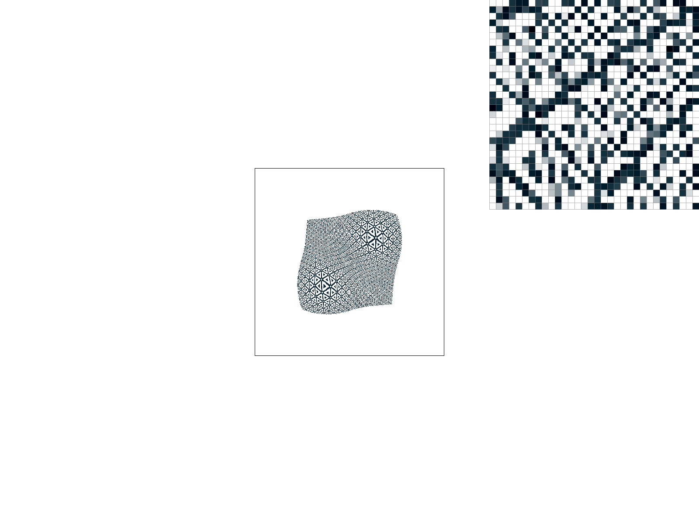
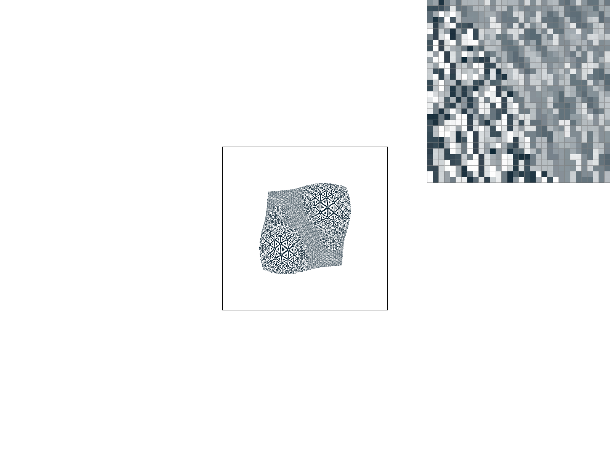

# Project 1

In this project, I filled in code to complete the implementation of a SVG
renderer. Specifically, I implemented logic to (semi-efficiently) identify which
pixels lie inside a triangle based on the location of its vertices. I
implemented supersampling-based anti-aliasing to reduce "jaggies" in the
rendering. For triangles, I also implemented color and texture interpolation
based on barycentric coordinates. The textures were sampled using various forms
of interpolation, using mipmaps to efficiently remove high-frequency artifacts
as appropriate.

## Task 1
Each triangle is defined by three points $(x_i, y_i)$ for $0 \le i < 3$. We
first compute the bounding box of the triangle, bounded by the minimum and
maximum x and y coordinates of these three points. Then, we loop over each test
point $(x, y)$ within this bounding box to check if it lies inside the triangle.

To do so, we make the following observation. Consider a vector representing the
direction of a line passing through the origin. Rotate it 90 degrees
counterclockwise. Then project a test point onto this vector using dot products.
The sign of this projection is positive if the test point is to the "left" of
the original line (facing along the direction vector), zero if it lies on the
line, and negative if it lies to the "right". By translating all coordinates, we
can make a similar determination for the position of a point with respect to a
line not passing through the origin, so long as we know its direction vector and
at least one point on the line.

Now, note that the triangle's vertices are ordered so they are oriented either
"clockwise" or "counter-clockwise". If clockwise, then a point lies inside the
triangle iff it is not to the left of any line between two consecutive vertices.
If counter-clockwise, then a point lies inside the triangle so long as it is not
to the right of any line between consecutive vertices. So we can use the above
sign-of-the-dot-product test to check if a point lies inside the triangle in
either orientation. If so, we color it in, and otherwise we leave it blank.

Mathematically, the test looks like this (in pseudo-code):
```
// let (x, y) be our test point
// let pts[i] = (xi, yi), where pts[0] == pts[3]
cw = true;
ccw = true;
for i in 0..3:
    // the line goes from pts[i] to pts[i+1]
    // treat pts[i+1] as the offset, to translate our line through the origin
    // let (dx, dy) be the direction vector of the line
    dx = pts[i+1][0] - pts[i][0];
    dy = pts[i+1][1] - pts[i][1];

    // we are taking the inner product of (-dy, dx) with ((x, y) - offset)
    auto l = -(x - pts[i+1][0]) * dy + (y - pts[i+1][1]) * dx;

    // if we lie to the left or the right of a line,
    // we rule out the clockwise/counter-clockwise cases, respectively
    if (l > 0) {
        cw = false;
    }
    if (l < 0) {
        ccw = false;
    }
}

// if we are consistent with one orientation, then we are inside the triangle!
inside_triangle = cw || ccw;
```

My algorithm literally just checks every sample within the bounding box, so it
is obviously no worse than such an approach.

A rendering of `basic/test4.svg` follows: 

The inspector is zoomed in on the rightmost coerner of the red triangle. We see
jaggies due to the lack of anti-aliasing, as the triangle thins to a point.

## Task 2
In supersampling, we increase the size of the `sample_buffer` to `width * height
* sample_rate`. We index into it as `sample_buffer[y * width * sample_scale +
x]`, where `sample_scale * sample_scale = sample_rate`, and `x` and `y` are the
supersampled coordinates such that `0 <= x < sample_scale * width`, and `0 <= y
< sample_scale * height`.

The `fill_pixel(x0, y0)` function is modified to fill in all points `(x, y)`
where `x0 * sample_scale <= x < (x0 + 1) * sample_scale` and analogously for
`y`, so we are essentially filling in a small "box" in the buffer. So for points
and lines, which use this function, supersampling has no effect.

However, we do modify the `rasterize_triangle` function to test each sample in
the aforementioned "box" for membership in the triangle separately. This is
useful, since then if the border of the triangle passes "partially" through the
box associated with an actual output pixel, we end up coloring in that output
box "partly", making the borders "fuzzier" and reducing the effects of jaggies.
The fuzziness comes from the color averaging process as we write to the
framebuffer.

Finally, we modify the `resolve_to_framebuffer` function to average the color of
each point in the "box" corresponding to an actual output point `(x, y)`, before
writing to the `rgb_framebuffer_target`.

Below, we show how `basic/test4.svg` is rendered with sample rates 1, 4, 9, and
16 (left-to-right, then top-to-bottom):

{width=49%} {width=49%}
{width=49%} {width=49%}

Observe how the sharp corner of the triangle begins to "blur" into the
background. This is because we can now shade pixels based on the "fraction" that
they are covered by the triangle (estimated using supersampling), rather than
shading them either entirely, or not at all, depending on whether the triangle
covers the center point of the pixel. The greater the sample rate, the more
accurate this estimate becomes, and so the "smoother" the corner becomes"

## Task 3
Cubeman is [dabbing](https://en.wikipedia.org/wiki/Dab_(dance)).


I rotated the arms and legs after their translation, and changed the color of
the arms to make them more visible. I also scaled the head down in the
y-direction and translated it vertically slightly.

## Task 4
Imagine a triangle with coordinates $(x_i, y_i)$ for $0 \le i < 3$. Consider
some other point $(x, y)$. We wish to find coefficients $\alpha, \beta, \gamma$
such that $x = \alpha x_0 + \beta x_1 + \gamma x_2$ and $y = \alpha y_0 + \beta
y_1 + \gamma y_2$. Since there are three unknowns and only two constraints, this
system is underdetermined. So we add the constraint $\alpha + \beta + \gamma =
1$ to give us a unique solution.

Notice that $\alpha = 1$ and $\beta, \gamma = 0$ at $(x, y) = (x_0, y_0)$, and
similarly for the other two vertices. Moreover, we can show that $\alpha, \beta,
\gamma \ge 0$ exactly for points inside the triangle. So we can interpret these
coefficients as "weighting" the three vertices, to give us a point somewhere
inside their triangle. This gives us barycentric coordinates.

 The above illustration shows how barycentric coordinates are
used to weight the colors from each vertex of the triangle in order to shade its
interior. The vertices are colored red, blue, and green, and we use the
barycentric coordinates of each interior point to weight the color of the
vertices and smoothly interpolate between them.

A rendering of `basic/test7.svg` follows: 

## Task 5
When sampling from a texture, we use barycentric coordinates to map each point
$(x, y)$ within a textured triangle to coordinates $(u, v)$ on a texture image,
scaled such that `0 <= u < width` and `0 <= v < height`. These may be
non-integral values, so they do not correspond exactly to pixels in the texture.

The `P_NEAREST` sampling technique rounds `u` and `v` to integers, so they
correspond to a single pixel from the source texture, which we use as our
sampled color. The `P_LINEAR` technique interpolates between the four
surrounding pixels closest to $(u, v)$. Specifically, let $(u_0, v_0)$ represent
the rounded version of $(u, v)$, rounding down to the nearest integer. Then the
surrounding pixels used for interpolation are located at $(u_0, v_0), (u_0 + 1,
v_0), (u_0, v_0 + 1), (u_0 + 1, v_0 + 1)$. Bilinear interpolation first defines
the constants $s = u - u_0$ and $t = v - v_0$. Then, the interpolated color
becomes
```
color = (
    (1 - s) * (1 - t) * texture[u0, v0]
    + s * (1 - t) * texture[u0 + 1, v0]
    + (1 - s) * t * texture[u0, v0 + 1]
    + s * t * texture[u0 + 1, v0 + 1]
)
```
So what we are doing here is weighting each of the four surrounding grid points
quadratically based on the product of the horizonal and vertical distances
between them and the sample point.

We now compare the nearest and bilinear sampling methods (left and right
respectively) on a reference image using both 1x and 16x supersampling rates
(top and bottom respectively):

{width=49%} {width=49%}
{width=49%} {width=49%}

## Part 6
To prevent aliasing effects, we woud like to sample from a texture with all
frequencies higher than the sampling frequency removed. To do this, we prepare
"mipmaps", versions of the texture at progressively lower resolutions (by
blurring adjacent pixels together). For each sample, we draw our color from the
appropriate mipmap level, and avoid aliasing artifacts.

In `L_NEAREST` mode, we choose the mipmap level whose maximum frequency is
nearest to our sampling frequency, and sample our pixel from it. In `L_LINEAR`
mode, we sample from mipmap levels above and below the sampling frequency, then
take a weighted average of them to produce the final output.

To determine our sampling frequency, we compute the texture sample points `(u,
v)` for our test point `(x, y)`, as well as for `(x + 1, y)` and `(x, y + 1)`,
then look at the differences in the texture sample points. We take the maximum
length of the two texture position offset vectors to determine the lowest sample
frequency, and then choose the mipmap whose resolution is closest to that.

Level sampling has the lowest performance overhead, since in `L_NEAREST` mode it
just affects which mipmap we choose to use as a source for our sample. Even in
`L_LINEAR` mode, we only need to make two samples, from the mipmaps above and
below our target frequency, and then weight them together with a single lerp.
However, it requires additional memory to store all the mipmaps to be used for
sampling

Pixel sampling has a higher computation overhead, since we need to sample from
four pixels and then perform three lerps to weight them together. But it does
not require any additional memory to store textures / buffer output. It also
provides better anti-aliasing / blur when our sampling frequency is higher than
the source resolution of the texture, since the pixel boundaries are blurred
together (as shown above).

Finally, supersampling has the greatest antialiasing power, but has the highest
memory and runtime overhead. This is because we need to repeat all our
computation once for each subsampled pixel, as well as store an output buffer
`sample_rate` times larger than the actual frame buffer, so there is both a
runtime and memory penalty. The advantage is that we get anti-aliasing not just
for textures, but also for the edges of polygons.

We compare `L_ZERO` and `L_NEAREST` level sampling (top vs bottom) as well as
`P_NEAREST` and `P_LINEAR` pixel sampling (left vs right) in the below grid.

{width=49%} {width=49%}
{width=49%} {width=49%}

We see that with `L_NEAREST` level sampling, there is a discontinuity as we
switch mipmap levels, where the "blurriness" of the image increases between
triangles. We also see that with `P_LINEAR`, the image is also generally more
"blurry" and individual pixels in the backing texture are less visible, since
they are interpolated together.
