# Project 2

In this project, I implemented code to generate and manipulate Bezier curves,
surfaces, and triangle meshes represented using the half-edge data structure. I
found the mesh upsampling implementation particulary interesting, since it
demonstrated how composing relatively simple operations (edge splitting and
flipping) could yield surprisingly nontrivial results.

## Part 1
de Casteljiau's algorithm is an iterative algorithm that repeatedly computes
weighted averages of input points, until we obtain a single point. By changing
the weight parameter, we can trace out a curve that depends on the inputs, known
as a _Bezier curve_.

More precisely, we start with a weight parameter $t$ from $[0, 1]$. Then, in
each iteration, we take adjacent pairs of input points $p_1$ and $p_2$ and
average them based on this parameter to produce $(1-t)p_1 + tp_2$. Since we do
this for each adjacent pair, each iteration produces one fewer output point than
it has inputs. So starting with $n$ points, after $n-1$ iterations, we end up
with a single point. Notice that when $t = 0$ and $t = 1$, this final point is
the start or end control , respectively. And for values of $t$ in between, we
sweep out a curve that is part of a degree-$(n-1)$ polynomial.

The following images show each stage of the Bezier interpolation process,
culminating with a final point.

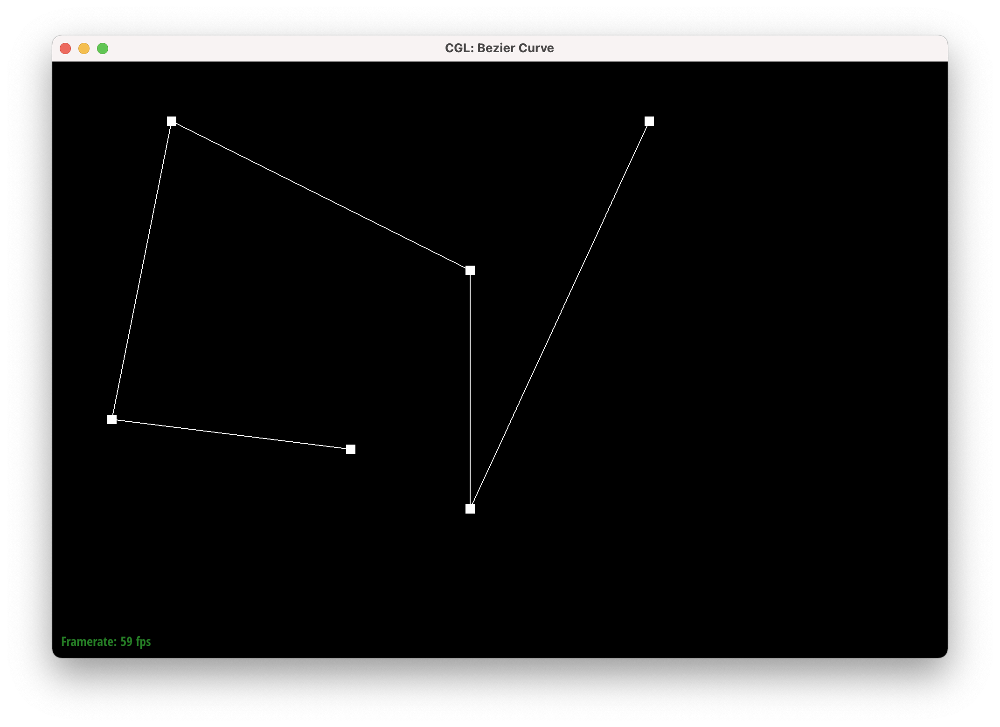{width=49%} {width=49%}
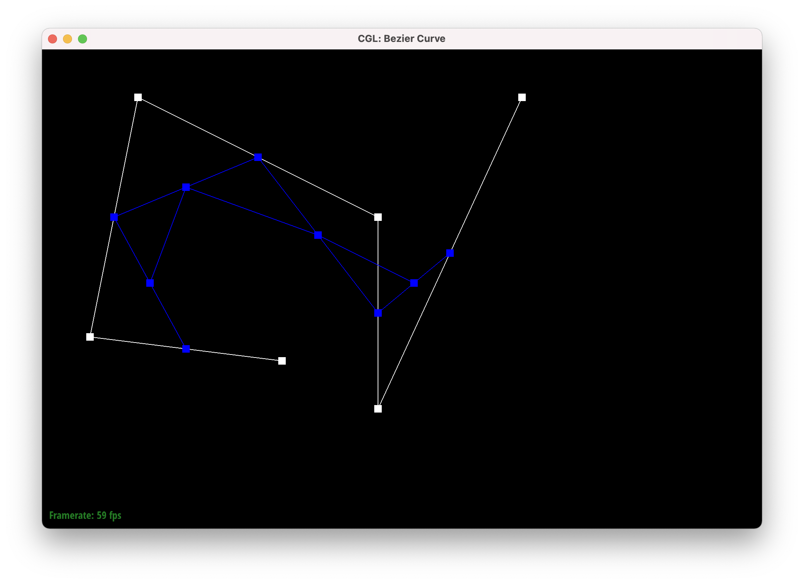{width=49%} 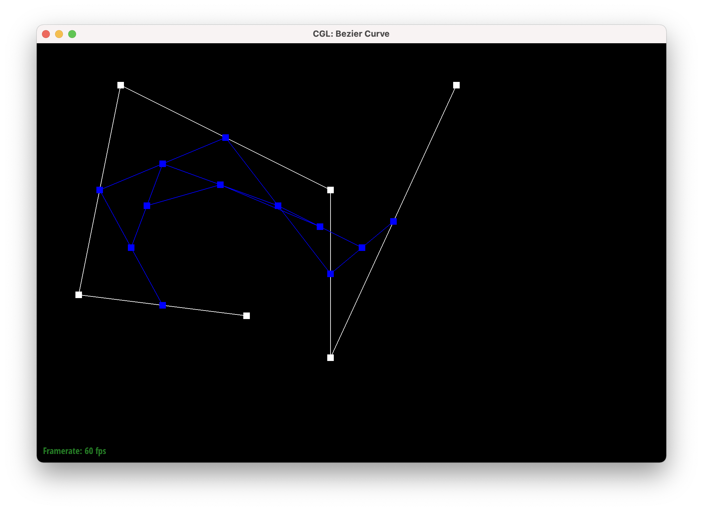{width=49%}
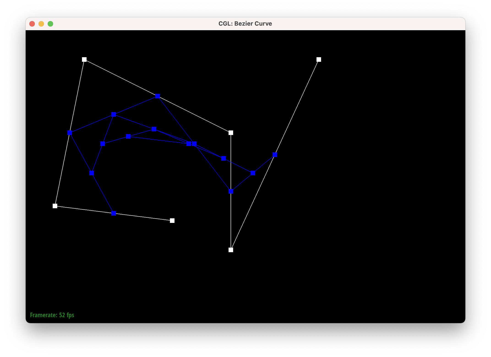{width=49%} {width=49%}

The full Bezier curve is below, as is a slightly different curve formed by
slightly perturbing the original control points:

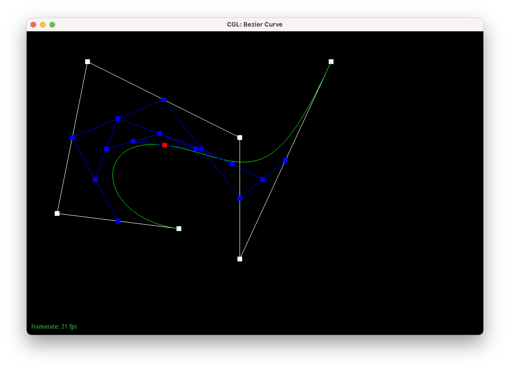{width=49%}
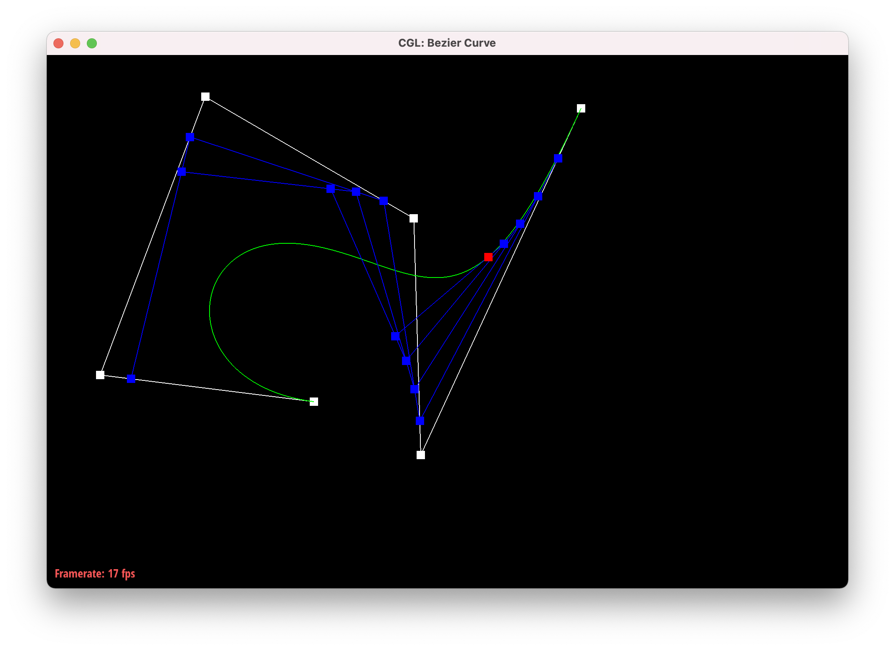{width=49%}

## Part 2
To extend Bezier curves to 3D (forming _Bezier surfaces_) we now require $n^2$
points arranged in a logical grid `points[N][N]`, between which we will form the
surface. We will do so by iterating over the dimension. First, for a given
parameter $s$, we will compute the 1D Bezier-interpolated point for each "row"
of of our control points. This gives us $n$ new points, which describe a Bezier
curve (using the technique described above, with an additional parameter $t$
used to select a point on this curve). So by varying $s$, we can "sweep'' this
curve across the entire grid, to form a Bezier "patch". Composing many of these
points together gives us a surface, such as the teapot shown below:
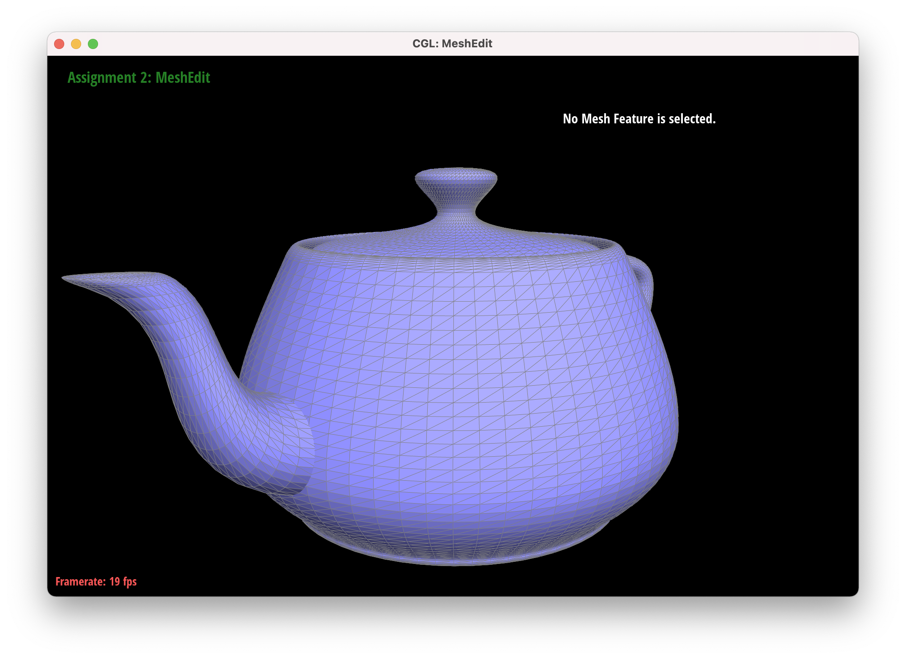

## Part 3
Here, we needed to compute the normal vector of each face, whose length equals
the area of the face. Then, we took the average of all these area-weighted
normals around a given vertex, and re-normalized to compute the _area-weighted
vertex normals_.

To compute the normal vector of each face, we took cross products between
adjacent position vectors of the face's vertices. For triangular faces (which we
are working with) this is equivalent to taking the cross product of vectors
representing two edges, which is well known to yield a vector normal to the face
and with area equal to the face - exactly what is desired. We then simply
iterated over the faces adjacent to each vertex (ignoring boundary faces),
summed up all these normal vectors, and normalized.

Renders of the teapot with flat shading and Phong shading, respectively, follow:
{width=49%}
{width=49%}

# Part 4
I implemented the edge-flip operation in the standard manner. Starting from the
target edge, I traversed its local neighborhood to obtain the relevant edges,
vertices, and faces (assuming that all faces are triangular). If the input edge
was a boundary edge, I returned with no action. Otherwise, I updated the
half-edges of the target edge to go between the "opposite" vertices on the two
adjacent faces, and updated the faces, vertices, and edges accordingly to keep
the graph consistent.

There were no interesting implementation details. To make implementation simple,
I drew a diagram of the relevant part of the mesh, and labelled each quantity,
to make it obvious what needed to change. Then I could confidently write an
implementation that was immediately bug-free (as far as I can tell!).

Here, we show a mesh before and after edge-flips. Each image highlights the edge
that is flipped in its successor:

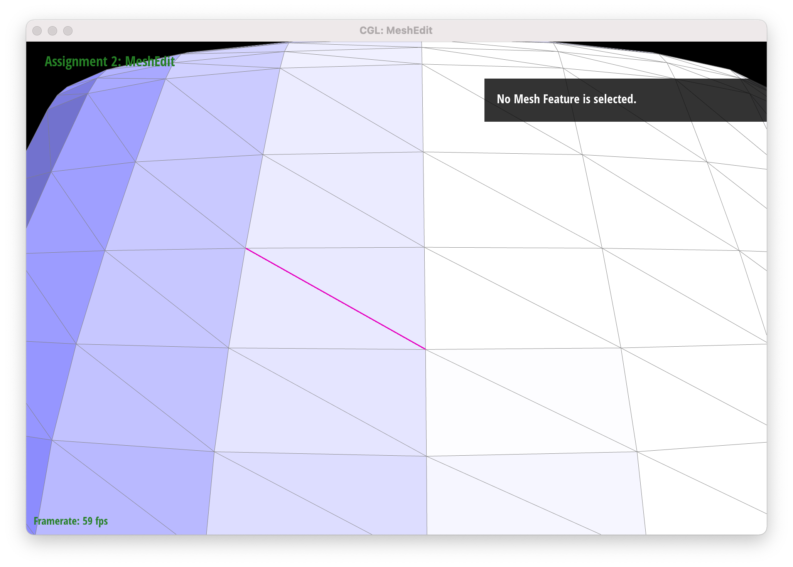{width=49%} {width=49%}
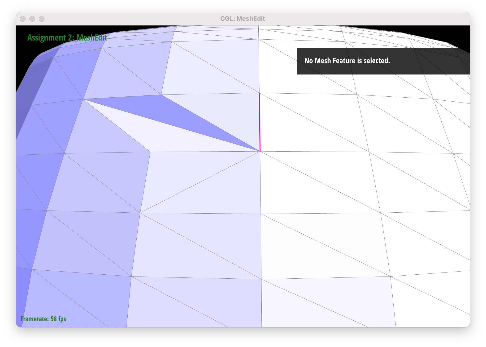{width=49%} 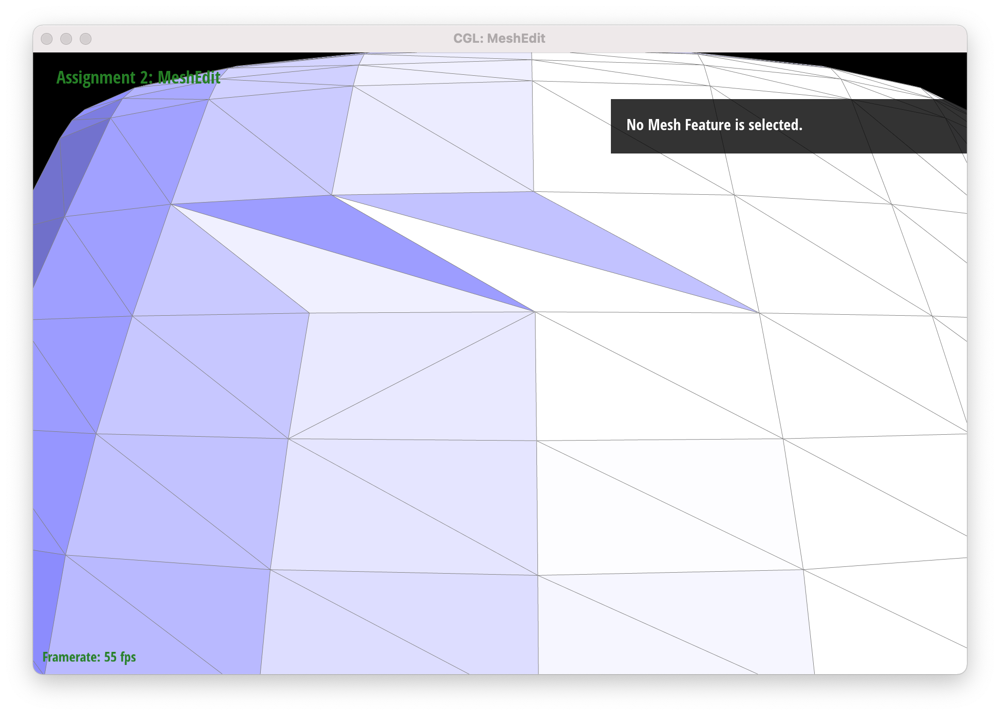{width=49%}

# Part 5
I implemented the edge-split operation in a similar manner to edge-flips. The
only element of note was that now, new elements had to be added to the mesh,
which I created using the built-in methods. As before, I drew diagrams of the
entire process, labeling each edge, half-edge, face, and vertex, so I could
simply directly write out the implementation in code. Unlike edge-flips, here I
simply updated every relevant parameter of each mesh object, rather than trying
to make the minimal set of changes, to ensure the implementation was bug-free
(which, again, I believe it to be). I also set the `edge.isNew` parameters in
preparation for the next part.

Here, we show a sequence of edge splits and flips on a mesh. The sequence of
operations performed is: split, split, split, flip, split, each time acting on
the highlighted edge:

{width=49%} {width=49%}
{width=49%} {width=49%}
{width=49%} 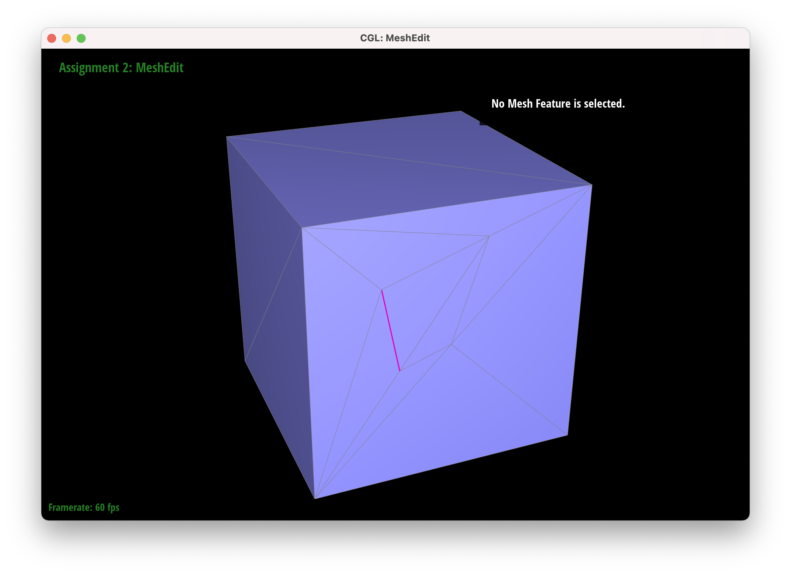{width=49%}

## Part 6
I implemented loop subdivision as per the skeleton code. First, I iterated over
each current vertex, marked each as `isNew = false`, and computed the
`newPosition` based on the old positions of its neighbors and the supplied
formula. Then, I iterated over each edge, marked it as `isNew = false`, and
computed its `newPosition` (i.e. that of the vertex at its center, once we split
the edge) using the supplied formula, traversing the local mesh to locate the
vertices not at the endpoints of the edge. Third, I looped over all the existing
edges, split them, and set the position of the new vertex to that of the
`edge.newPosition`. I used a counter to ensure we only looped over existing
(i.e. non-split) edges, since new edges are appended to the end of the mesh
edgelist. Next, I looped over all the edges again, flipping any that satisfied
the desired criteria (`isNew` and between a new and old vertex). Finally, I
updated the positions of all vertices to their `newPosition`.

I encountered no major bugs in this implementation, since most of the mesh
traversal logic was encapsulated in the edge flipping and splitting functions,
which were written carefully to ensure no bugs.

In general, as mesh subdivision is repeatedly applied on a mesh, it appears to
become more "rounded", with sharp corners becoming smoother curves. See the
following screenshots showing what happens to the corner of a cube:

{width=49%} {width=49%}
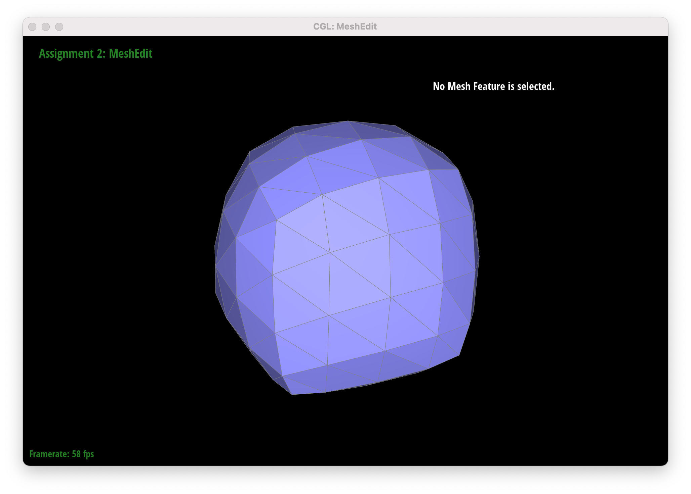{width=49%} 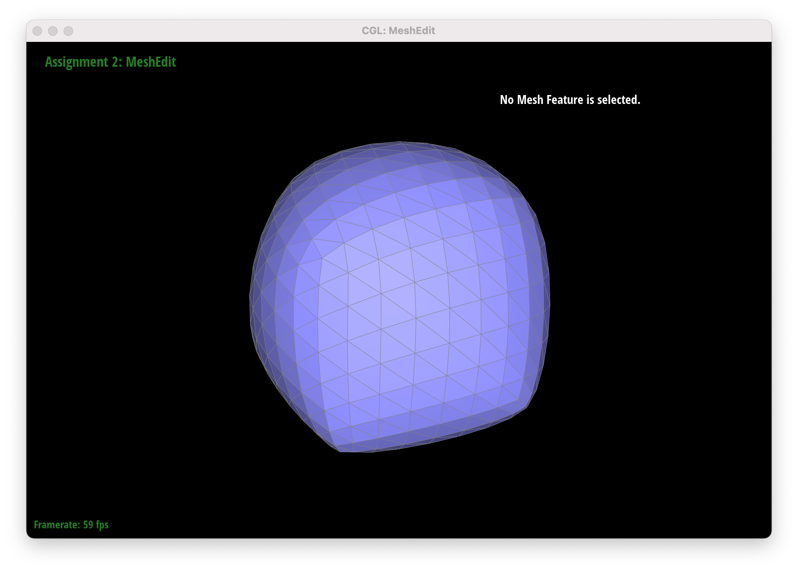{width=49%}
{width=49%} {width=49%}

By "pre-splitting" edges near a corner, we can reduce this effect. Intuitively,
it is as if we have more "sample points" to define the shape of the corner, so
smoothing has less of an impact. We see this to be the case, splitting some
edges near one corner in an ad-hoc manner, then observing how the corner stays
better defined as we repeatedly apply subdivision.

{width=49%}
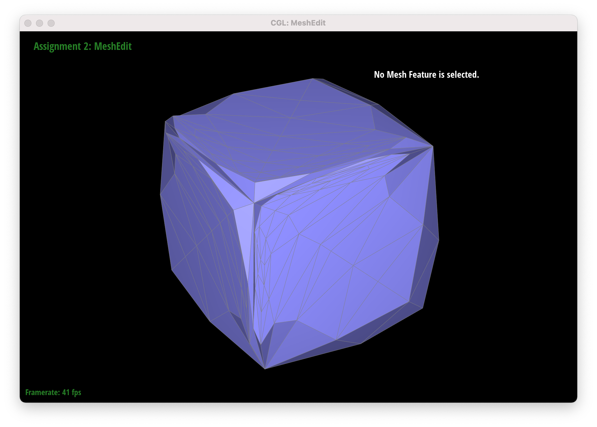{width=49%}
{width=49%}
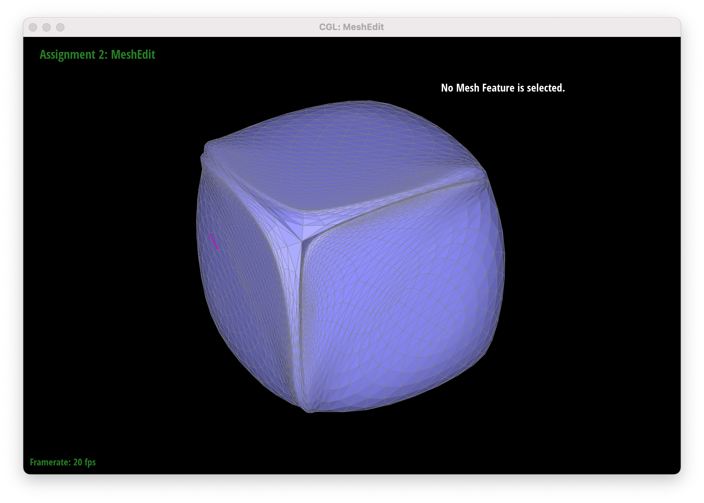{width=49%}

Finally, we note that the asymmetric output of repeatedly subdividing the
(unmodified) cube is because, although the actual shape is symmetric, the mesh
triangulation is not. By splitting all the face diagonal edges to make the
triangulation symmetrical, we can then apply subdivision to get a perfectly
symmetrical output:

{width=49%}
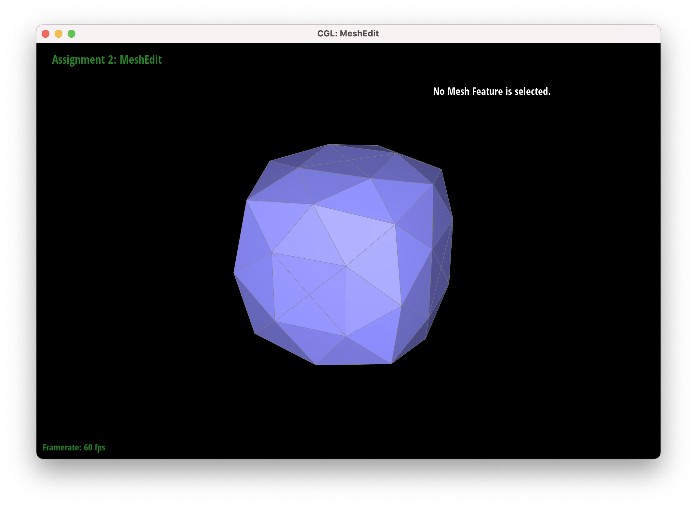{width=49%}
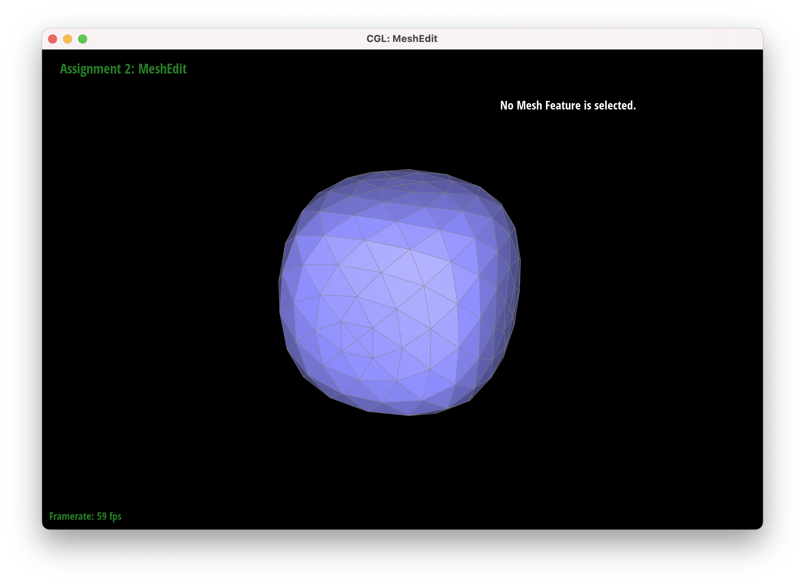{width=49%}
{width=49%}

Of course, the final output is not _spherically_ symmetric, but at least it is
symmetrical about the same axes that the cube initially was.

Website link:
[https://cal-cs184-student.github.io/sp22-project-webpages-rahularya50/proj2/](https://cal-cs184-student.github.io/sp22-project-webpages-rahularya50/proj2/).
