# Project 3-1

In this project, I implemented parts of a Monte-Carlo ray tracer, that renders
3D images with multi-bounce ray tracing onto diffuse surface BSDFs illuminated
by point and area light sources, as viewed by an idealized pinhole camera.
Adaptive sampling was used to control the level of noise at each pixel while
keeping computation costs down, and a bounded-volume-hierarchy generated using a
surface-area heuristic kept path intersection queries fast.

## Part 1
We iterate over each pixel in the target image. We repeatedly sample the pixel
color at a random point within the pixel square, and take the average to
generate the final color. For each sample, based on the position and orientation
of the camera, we convert its coordinates from camera space to a ray in camera
space, then to a ray in world space.

Then, we find the primitive object (spheres or triangles) that the ray hits
first. We do this by determining how far the ray travels before hitting each
object (if it does at all), and then selecting the closest object with a
positive travel distance (within some thresholds, to avoid rounding errors).
Initially, we just iterate over all objects and compute this distance, though we
will accelerate it in the next part. When we intersect an object, we populate an
`Intersection` object with fields like the object being intersected, the normal
vector at the point of intersection, the relevant BSDF to compute the color (in
future parts), and other relevant information.

The triangle intersection algorithm uses the [Moller-Trumbore
Algorithm](https://cs184.eecs.berkeley.edu/sp22/lecture/9-22/ray-tracing) to
determine the barycentric coordinates of the intersection point on the plane of
the triangle, expressing the coordinates with respect to the three vertices of
the triangle. If they are all nonnegative, then we know we have intersected this
plane within the triangle. This algorithm also gives us the distance of the
intersection point from the origin of the ray, which is a quantity we need
anyway. To determine the normal vector at the point of intersection, we take the
weighted average of the normals at each vertex of the triangle, with the weights
being the computed barycentric coordinates (just like we did in Project 2).

Below are two images rendered with normal shading, illustrating both triangles
and spheres:

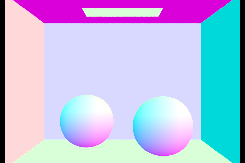{width=49%}
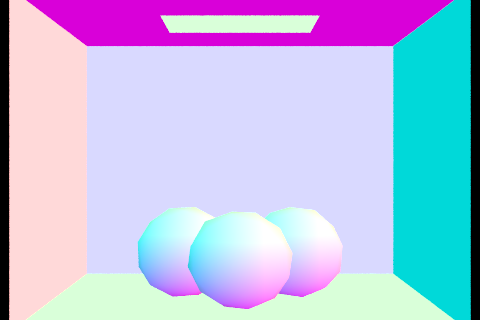{width=49%}

## Part 2
The essential idea of a bounded volume hierarchy (BVH) is to accelerate ray
intersection tests, by only considering a subset of primitives in a scene.

We construct it as a tree of bounding boxes. The leaf bounding boxes contain a
constant number of primitives. The bounding box at each node in the tree is the
minimal box that encloses all the primitives in any leaf node within the node's
associated subtree. Each primitive lies in exactly one leaf node. Note that this
means that two child bounding boxes of a node may overlap.

This tree is constructed recursively from a set of objects. We partition the set
of objects by sorting them in each of the `x`, `y`, and `z` directions (letting
the centroid of each object be its coordinate for this purpose). In each
direction, we choose the split point to be equidistant from the minimum and
maximum values of the centroid coordinate in that axis.

To select the optimal direction, we use the surface-area heuristic. After we
obtain a candidate split in each axis, we compute the number of objects on each
side (`n_L` and `n_R`) as well as the bounding boxes (`bbox_L` and `bbox_R`). We
then let the "cost" of this split be `n_L * surfaceArea(bbox_L) + n_R *
surfaceArea(bbox_R)`, as a proxy for the expected query cost for a random ray.
We then choose the axis with the minimum cost using this heuristic for the
actual split, and recursively partition both sides.

This recursion continues until the number of objects falls below a fixed
threshold, at which point we output a leaf node of the hierarchy containing
(pointers to) the primitives directly.

With this acceleration, we can render complex images with tens or hundreds of
thousands of primitives, such as the following:

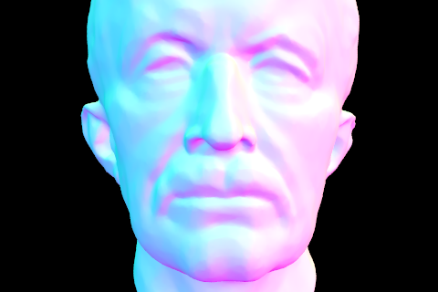{width=49%} {width=49%}

Next, we render a few scenes with and without BVH acceleration. In all cases,
they are rendered using normal shading on my local machine with no significant
other load, using 8 threads, and targeting an output resolution of `480x320`. We
ensured that thermal throttling did not occur during the benchmarks, to keep the
results fair. All render times were averaged across three runs, to reduce the
effects of random noise. All parameters were kept as the default, with adaptive
sampling used to determine the number of rays sent from each point.

For `cow.png`, with 5856 primitives (triangles), it took 0.5765s to render with
the above BVH, and 258.3s without it. With the BVH, we made an average of 3.49
intersection tests per ray, but without it we had to make 752.9 intersection
tests per ray, indicating that the BVH significantly reduced the number of
operations needed per ray.

Similar results were obtained for `banana.png` - the BVH reduced the running
time from 88s to 0.518s, and the number of intersection tests per ray from 291
to just 2.7.

Note that the intersection test counts are potentially inaccurate due to race
conditions across the various threads, so they should be interpreted only as a
qualitative improvement with the BVH (which is why they don't equal the number
of primitives!).

## Part 3
With hemisphere sampling, the direct lighting function randomly selects a
direction from the hemisphere above the object (in object space, with the
z-direction corresponding to the surface normal in world space), to check for
incoming light. It computes the reflectance using the surface BSDF and the known
incoming and outgoing ray directions, the Lambert coefficient (the cosine of the
angle of the incoming ray with respect to the surface normal), and the incoming
light (by testing to see if the incoming ray intersects with a light source, and
if so returning the emissivity).

By taking the product of this emissivity, the reflectance, and the Lambert
coefficient, we obtain the contribution of a single sample. This process is then
repeated for `num_samples` samples (based on the number of lights in the scene
and a supplied constant) and averaged. Finally, we multiply by `2*PI`, since
each sample essentially is an estimate of the contribution of a random unit
solid angle in the relevant hemisphere, but the total angle to consider is
`2*PI` steradians.

With importance sampling, rather than drawing samples uniformly from the unit
hemisphere, we instead sample from directions pointing at the lights directly.
This reduces the computational effort, since we don't ever sample an incoming
ray with zero contribution (i.e. that does not intersect a light source). In
addition, it lets us handle point light sources, which have zero area but
nonzero radiance.

We do this by iterating over all the lights, and using the `sample_L` method to
randomly determine an incoming ray direction, its PDF, and the amount of
incoming light, as well as the distance along the incoming ray before we hit the
light. This method takes as an argument our position in world space. Then, we
run a second intersection test along the same incoming ray direction, to see if
we intersect any other objects before the light source (by restricting the max
distance of the ray to slightly less than the distance from the light). If so,
then we are in shadow, so the sample has zero contribution. Otherwise, we
multiply the incoming light contribution by the Lambert coefficient (computed in
the same way as before), the reflectance (using the BSDF, just as before), and
divide by the returned PDF (as per the importance sampling procedure). We then
average this over a fixed number of samples, and then sum over all the lights.

One optimization we do is, for point lights, to only make a single sample. This
is because there is only one possible ray from the test point to the light
source, so it does not help us to average over many samples.

Below, we render the `CBBunny` and `dragon` scene with hemisphere (on the left)
and importance sampling (on the right), using 32 samples per pixel, and 16 light
rays per area light:

{width=49%}
{width=49%}
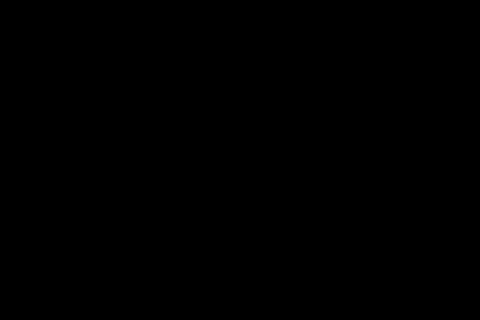{width=49%}
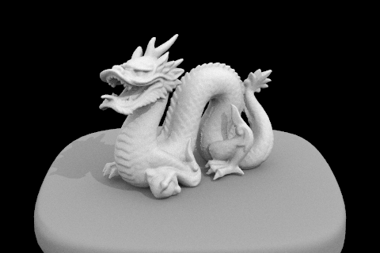{width=49%}

Notice that with the same number of samples, importance sampling produces a much
cleaner image. Note also that hemisphere sampling produced a blank image for the
`dragon` scene, since it is illuminated with a point light source.

Below, we render the `CBBunny` image with 1, 4, 16, and 64 light rays per area
light using importance sampling, while always taking only a single sample per
pixel:

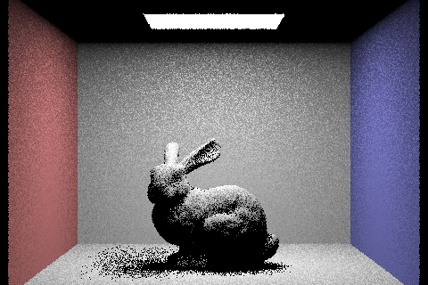{width=49%}
{width=49%}
{width=49%}
{width=49%}

We see that the noise in the area with "soft shadows" (meaning that part, but
not all, of the area light is obscured by the bunny) decreases as the number of
samples increases. This makes sense, since we would expect the variance across
pixels to go down with more samples. With only a single light sample and sample
per pixel, then there is no "soft shadow" at all, since for each pixel the
single sample made either hits the light (so it is fully illuminated) or is in
shadow (so it is entirely dark).

We consider the `CBBunny` with 32 sample per pixel and 16 rays per area light,
using both hemisphere and importance sampling, shown below:

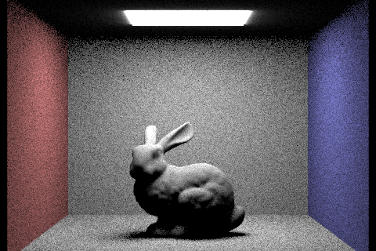{width=49%}
{width=49%}

Observe that with uniform hemisphere sampling, the image is significantly
grainier everywhere, even in areas of full illumination. In contrast, the
importance-sampled image is slightly grainy in the areas of soft-shadow, but is
very crisp elsewhere. This is because in importance sampling, all of our rays
are hitting the area light, and so are contributing a very similar amount. The
effect of the portion of the hemisphere occupied by the area light is affected
by the PDF factor. However, in uniform sampling, this latter effect is
determined by averaging across rays that hit the area light (and so contribute
to illumination) and rays that do not (and so contribute nothing). So clearly,
the variance is much higher, as we have a large number of zeros in our samples
that are not there with importance sampling, leading to the observed effect
above. In importance sampling, we only get zeros due to shadowing, so the
grainyness is only visible in the soft-shadowed regions (as the fully shadowed
regions are not illuminated at all in any case).

## Part 4
The indirect lighting function uses the Monte-Carlo sampling process described
in lecture to explore arbitrarily deep ray-depths with geometrically reducing
probability (we chose a continuation probability of `0.4` at each bounce past
the first).

At each intersection, to compute indirect lighting, we compute the one-bounce
radiance as described in the previous part. Then, with probability `1 - 0.4 =
0.6`, we return here (except in the initial bounce, when we never return). We
also immediately return if we have reached the max ray depth. Otherwise, we
randomly select a ray bounce direction using the `sample_f` function from the
BSDF (which for the time being, just picks a random direction from the
hemisphere above the surface). We shoot a ray in that direction and see if it
intersects anything (adjusting `min_t` to avoid self-intersection). If it does,
we recursively determine the `at_least_one_bounce_radiance` from that
intersection - otherwise, we sample from the environment lighting in that
direction. We then scale our result by the Lambert factor (as in the previous
part), the reflectance coefficient from the BSDF, and divide by the PDF returned
from sampling from the BSDF. Finally, to keep our estimator unbiased, we divide
by the continuation probability above, so that we are not discounting the
contribution of multiple bounces just because we sample them less often.

Below are the `CBBunny` and `CBSpheres_lambertian` scenes rendered with global
illumination, using 1024 samples per pixel, a max ray depth of 100, and 4
samples per area light:

{width=49%}
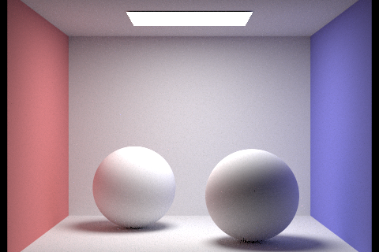{width=49%}

Below is `CBBunny` rendered with only direct illumination, as well as only
indirect illumination:

{width=49%}
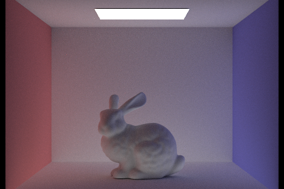{width=49%}

We see that indirect illumination lights the bunny a lot more evenly, but where
a lot of the light has bounced off of the left or right walls, and so parts are
lit up either red or blue. We discuss this further later in the report.

Below is `CBBunny` rendered with 1024 samples per pixel, 4 samples per area
light, and max ray depth of 0, 1, 2, 3, and 100:

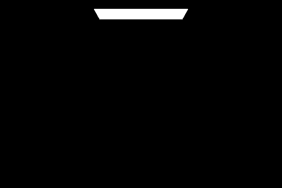{width=49%}
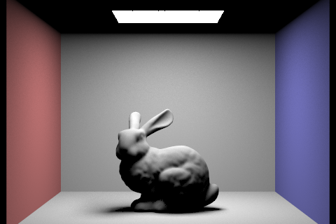{width=49%}
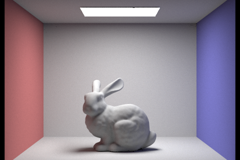{width=49%}
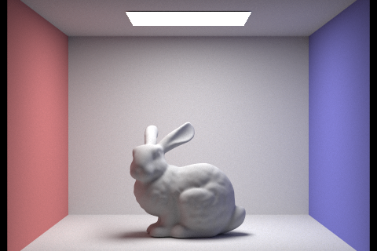{width=49%}
{width=49%}

With depth 0, we only see the light source. With depth 1, we only see the parts
of the bunny directly illuminated by the area light, as in the previous part.
With depth 2, parts of the bunny that are indirectly illuminated by light
reflected off the floor and walls are also lit up, with the sides colored
slightly due to the colored light reflecting off the walls. As the depth
increases further, very little difference is visible (at least to me), since
each reflection reduces the intensity of the light - one small change might be
that the shadows become slightly softer and more obviously tinted, and that the
back wall is colored slightly red and blue due to light bouncing off the side
walls.

Below is `CBBunny` rendered with 1, 2, 4, 8, 16, 64, and 1024 samples per pixel,
using 4 light rays, and a max ray depth of 100.

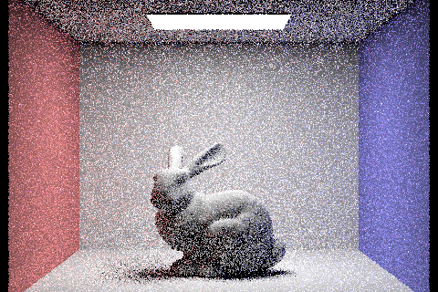{width=49%}
{width=49%}
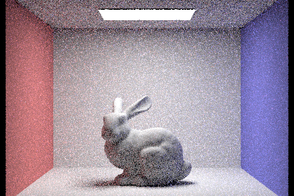{width=49%}
{width=49%}
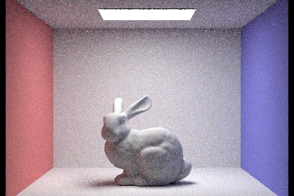{width=49%}
{width=49%}
{width=49%}

The images clearly become less grainy as the number of samples increase.

## Part 5
To implement adaptive sampling, we added early-exit to the core while loop
sending rays for each pixel. Following the formulas supplied in the spec, we
compute the mean value of the illuminance, as well as its standard deviation, by
computing the sum and the sum-of-squares of the illuminance. Every
`samplesPerBatch` iterations, we estimate the squared standard deviation and
compute the 95% confidence interval of the illuminance. If this is smaller than
the `maxTolerance` times the mean illuminance (plus a small constant to handle
regions with zero illuminance), then we early-exit from the loop. This is
because the variance we are observing in our samples is so small that our
existing estimate (i.e. the mean) is also very close to the "true" value with
high probability, so it does not make sense to take further samples.

Below is `CBBunny` rendered with a maximum of 2048 samples per pixel using a
single light ray per area light. On the left is the actual image, and on the
right is a figure showing the areas where more samples were required to reach
the target threshold:

{width=49%}
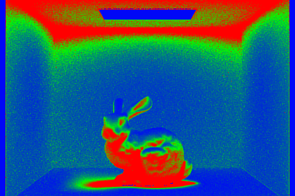{width=49%}

Website link:
[https://cal-cs184-student.github.io/sp22-project-webpages-rahularya50/proj3-1/](https://cal-cs184-student.github.io/sp22-project-webpages-rahularya50/proj3-1/).
