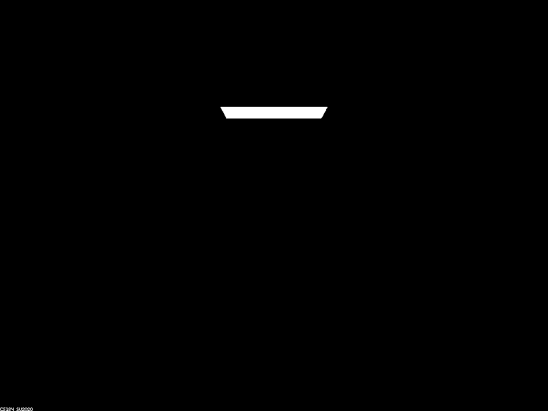
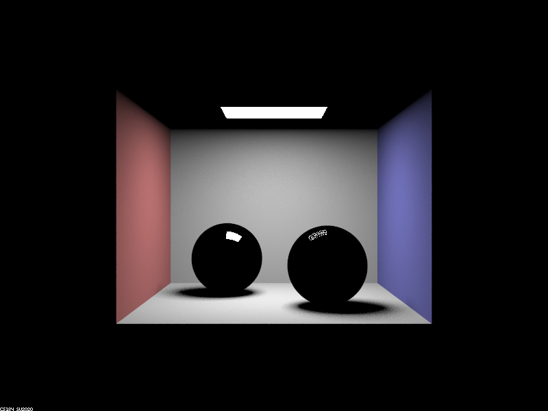
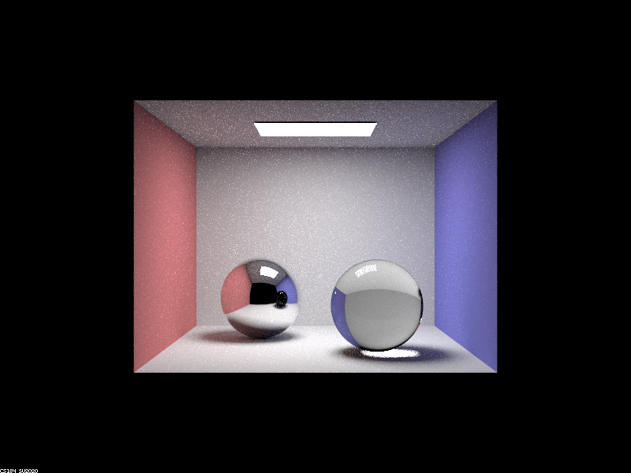
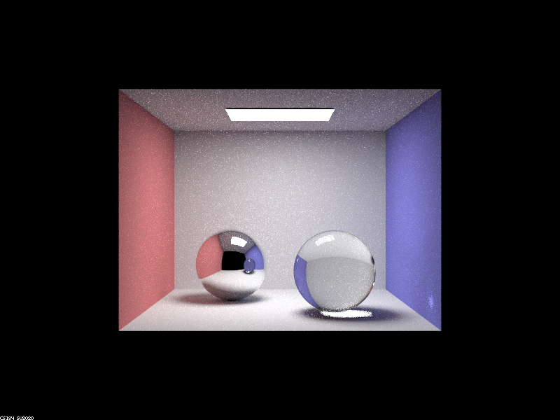
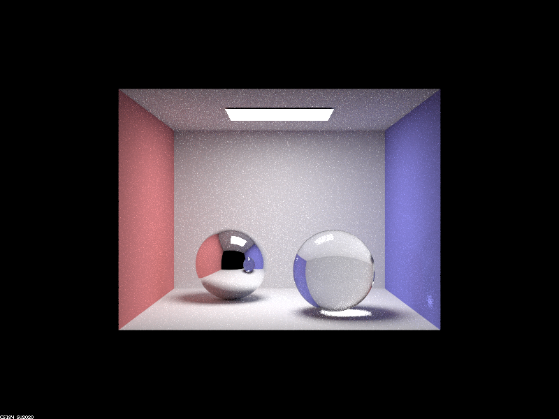
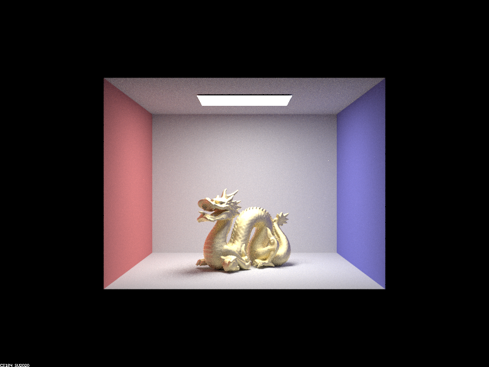
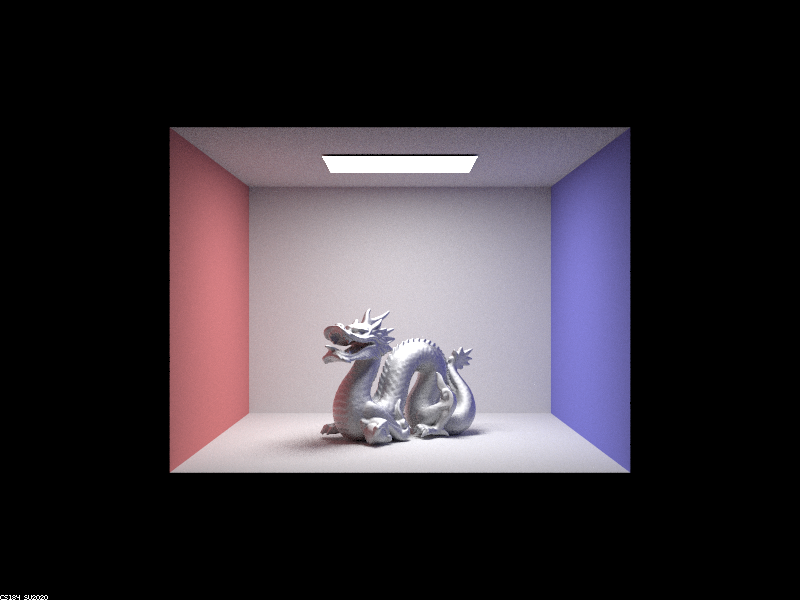

# Project 3-2

In this project, I implemented BSDFs for reflective, refracting, and
microfaceted materials. I completed the first two tasks. Below is a bunny I
rendered!

{width=99%}

## Part 1
The following images show the `CBSpheres` environment rendered with 0, 1, 2, 3,
4, 5, and 100 ray bounces, using 64 samples per pixel, 4 samples per light, and
adaptive sampling.

<!-- Yes, it says bunny, sorry -->
{width=49%}
{width=49%}
{width=49%}
{width=49%}
{width=49%}
{width=49%}
{width=49%}

The zero-bounce rendering shows just the surface light. The one-bounce rendering
shows the walls directly illuminated by the light, as well as a reflection of
the light in both spheres. Note that the refractive sphere has a weaker
reflection, due to the Fresnel equations splitting incident light into reflected
and refracted portions.

With two bounces, the reflective sphere is now reflecting its environment (since
rays hit the sphere, the environment, and then the room light). The refractive
sphere is not yet refracting (since refraction has two ray bounces to both enter
and leave the sphere, whereas reflection has just one), but we can see the
partial reflection of the environment on its surface.

With three bounces, the refractive sphere is now refracting light, since rays
enter it, leave it, hit the environment, and finally reach the room light. With
four bounces, the refractive sphere also refracts _in it's reflection_ in the
reflective sphere, and casts some refracted light onto the room wall.

Very little change is visible with 5, and then 100 bounces. The only difference
visible (to me) is the shadow of the refractive sphere, which acquires a slight
tint, likely from rays being refracted, bouncing off the floor, the walls, and
finally reaching the room light.

## Part 2
The following renders show `CBdragon_microfacet_au` rendered with alpha set to
0.005, 0.05, 0.25, and 0.5, using 128 samples per pixel and one sample per
light, with 5 ray bounces.

{width=49%}
{width=49%}
{width=49%}
{width=49%}

We see that as alpha increases, the dragon looks more "rough" and less "shiny".
It also gets less noisy - the white spots are due to an extremely small pdf
causing a high radiance, which is more likely to occur with a small alpha.

Below are two renders of `CBbunny_microfacet_cu`, rendered with cosine sampling
(on the left) and importance sampling (on the right):

{width=49%}
{width=49%}

We see that the render with importance sampling has fewer white spots and is a
lot less noisy in general. This is because, with cosine sampling, most of our
samples are those with no reflected light, so they do not contribute to
illumination. Whereas with importance sampling, we are focusing on the incident
light directions that contribute to illumination, so the variance of the surface
illumination is reduced (though in expectation both techniques should work).

Finally, below is a render of the microfaceted dragon with the chromium
material: {width=999%}

Since chromium is a relatively grey element, the eta and k parameters do not
vary greatly with the frequency of the incident light.

Website link:
[https://cal-cs184-student.github.io/sp22-project-webpages-rahularya50/proj3-2/](https://cal-cs184-student.github.io/sp22-project-webpages-rahularya50/proj3-2/).
