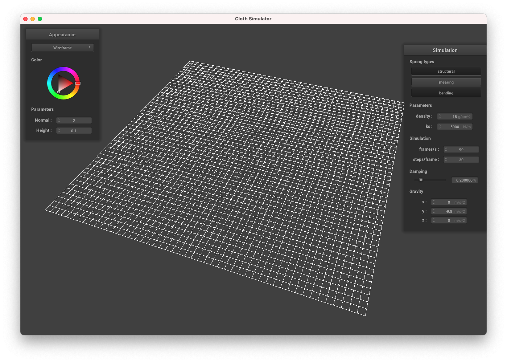
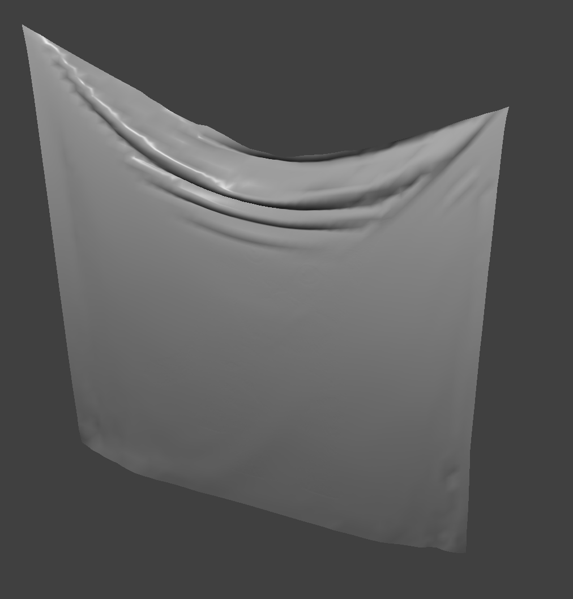
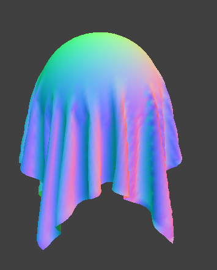
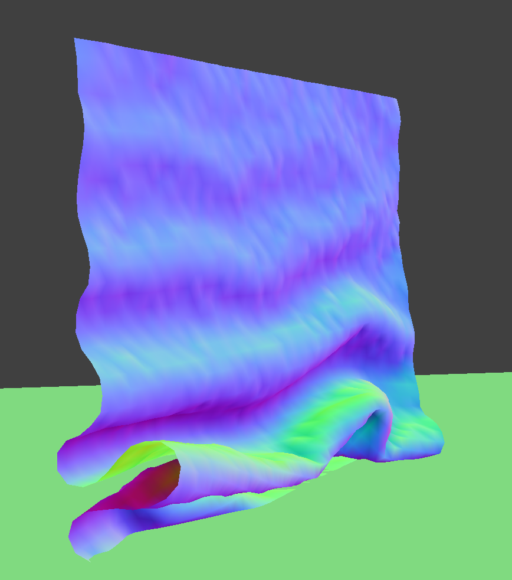
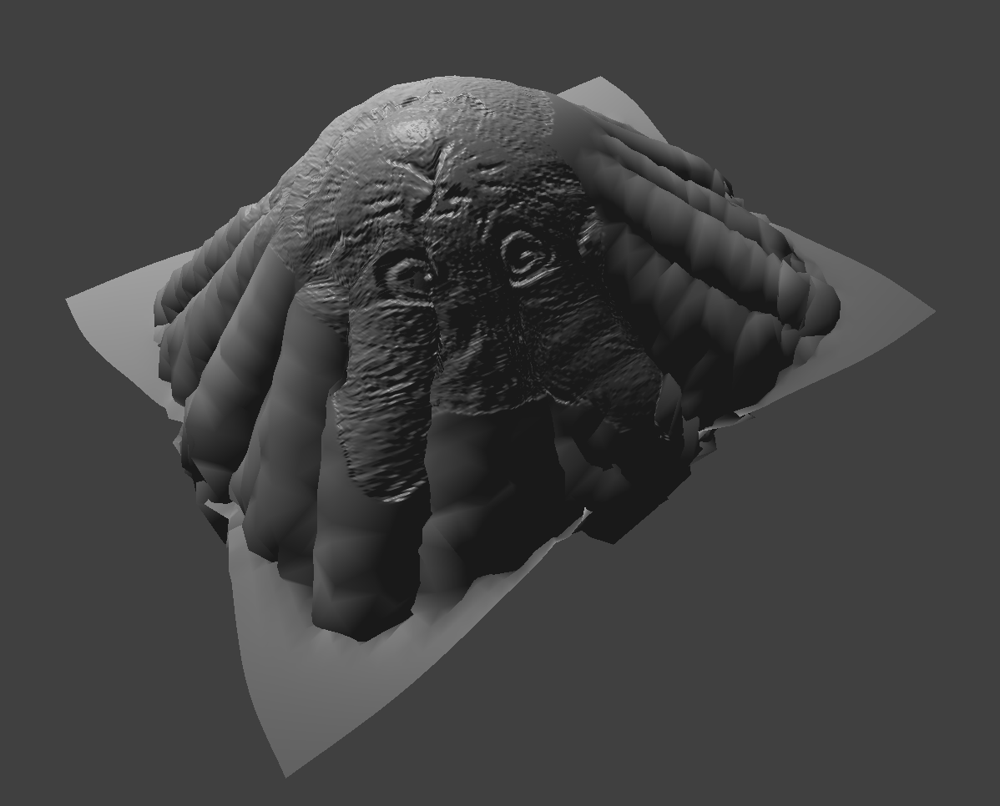
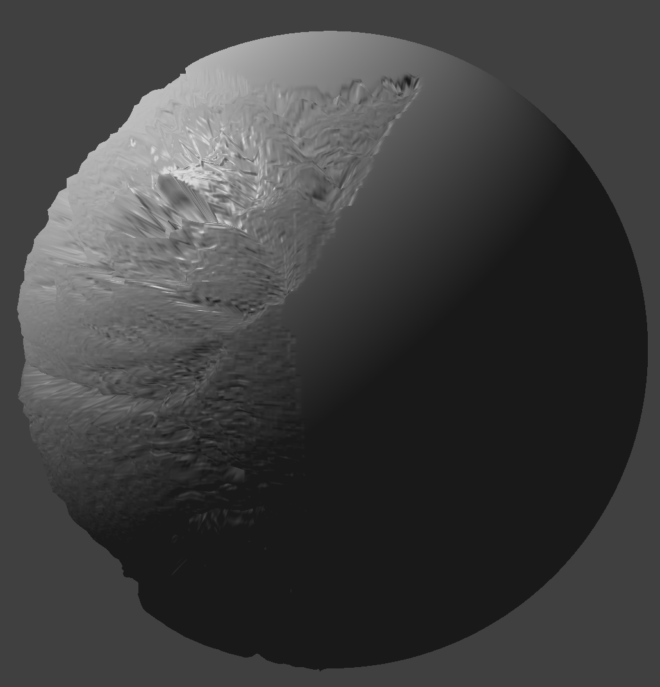
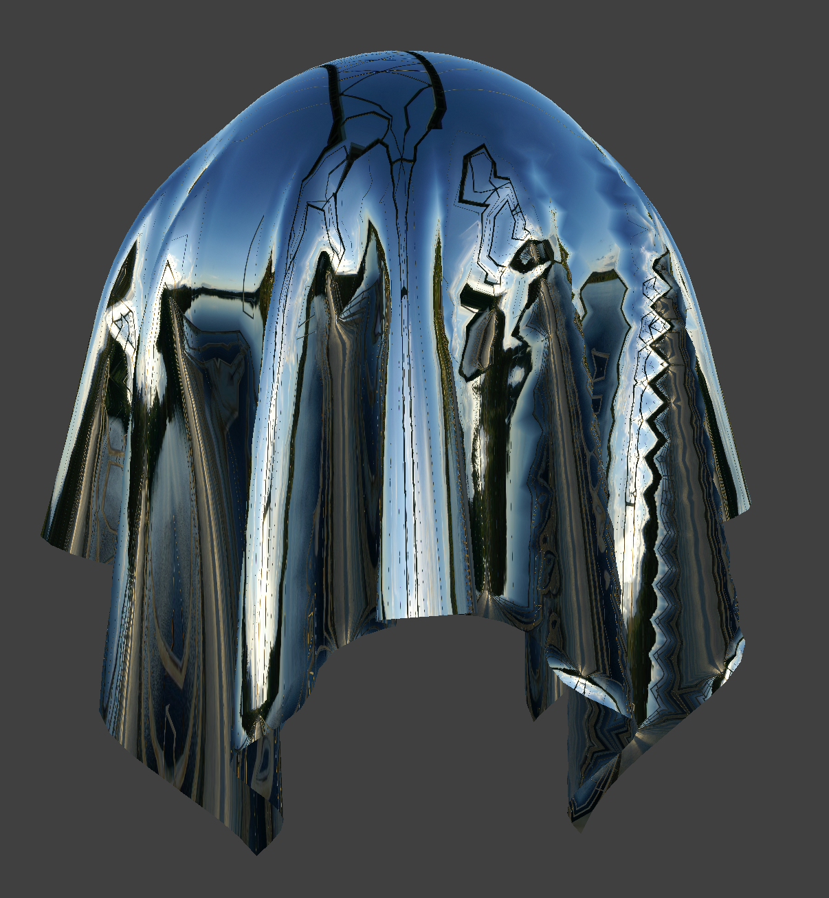

# Project 4

In this project, I implemented cloth simulation by modelling a cloth as a grid
of point masses linked by springs. My simulation included interaction with other
objects in the environment as well as self-collision. Finally, I also wrote
various shader programs to render the cloth as a solid object.

## Part 1
Below is the wireframe of the cloth with all constraints enforced:

Below, from left-to-right, are the wireframes with only the shearing constraint,
and with all but the shearing constraint (open in new tab for clearest
experience):

{width=49%}
{width=49%}

The shearing constraint connects diagonally-opposing nodes in the mesh, while
the other constraints connect those in the same row/column only.

## Part 2
Here is the cloth with default parameters and normal shading after it settles:

Reducing the spring constant makes the cloth more "elastic", so it sags lower
when it settles, rather than staying up near the center. The opposite is true
when increasing the spring constant.

Increasing the density has the same effect as reducing the spring constrant
(since what matters is the ratio of force-to-mass). On the left is an example
with a low density and high spring constant, and on the right is an example with
a high density and low spring constant.

{width=49%} {width=49%}

Reducing the damping causes the cloth to not "settle" after it falls, making it
instead bounce back up and down for several cycles until it stops (assuming the
damping is not zero). Below we see the cloth bouncing back after falling in an
underdamped setting, in the `pinned4` environment:

## Part 3

The three images below show the cloth resting on the sphere with `ks = 500`, `ks
= 5000`, and `ks = 50000` respectively:

{width=32%} {width=33%}
{width=33%}

Observe how as the spring constant increases, the cloth has less of a tendency
to "stretch" below the sphere itself, and instead holds more of its shape rather
than hanging straight down.

We also see the cloth lying on a flat plane, with a texture applied to make the
contrast clearer:

# Part 4
The three images below show the progression of the cloth collapsing with default
parameters: {width=32%} {width=33%}
{width=33%}

When we increase the spring constant (or, equivalently, reduce the density) the
folds appear to become larger/looser, since the cloth cannot fold as tightly
(see left image). The reverse is true when we reduce the spring constant /
increase the density, as shown on the right, where the folds become smaller and
more numerous.

{width=49%} {width=49%}

## Part 5
A vertex shader takes in parameters from the simulation and determines the final
position of the displayed vertices, while passing information to the fragment
shader. The fragment shader takes in inputs from the vertex shader and
determines the color of the vertex to be rendered.

Blinn-Phong is made up of three components: an ambient component that uniformly
illuminates the surface regardless of orientation, a diffuse component that
illuminates the surface based on the angle of the camera with respect to the
surface normal independent of the camera's position, and a specular component
that illuminates highlights based on the position of the camera as well as the
incident light, with the direction of perfect reflection yieldigin the maximum
reflectance.

The three screenshots below show the ambient, diffuse, and specular components
respectively, of a sphere:

{width=32%} {width=33%}
{width=33%}

The full shading with all three components is shown below: 

The cloth shaded using a custom image of a cat is shown below:

The cloth shaded using the same custom image via bump mapping (on the left) and
displacement mapping (on the right) as below:

{width=49%} {width=49%}

Displacement mapping causes distortion of the cloth and sphere surfaces, not
just a change in the color. When zoomed in, it is more obvious that the cloth is
deformed slightly based on the texture.

The coarse (on the left) and fine (on the right) applications of this custom
texture to the sphere are shown below, with the height and normal parameters
held constant, for both bump mapping (at the top) and displacement mapping (on
the bottom):

{width=49%} {width=49%}
{width=49%} {width=49%}

Observe that while the bump mapping appears unchanged, the displacement mapping
appears to have more facets. A consequence is that the actual pattern on the
surface becomes less clear, since the changing displacement causes the bump
coloration to be less clear.

Finally, the mirror texture is illustrated below on both the sphere and the
cloth:

{width=49%} {width=49%}
